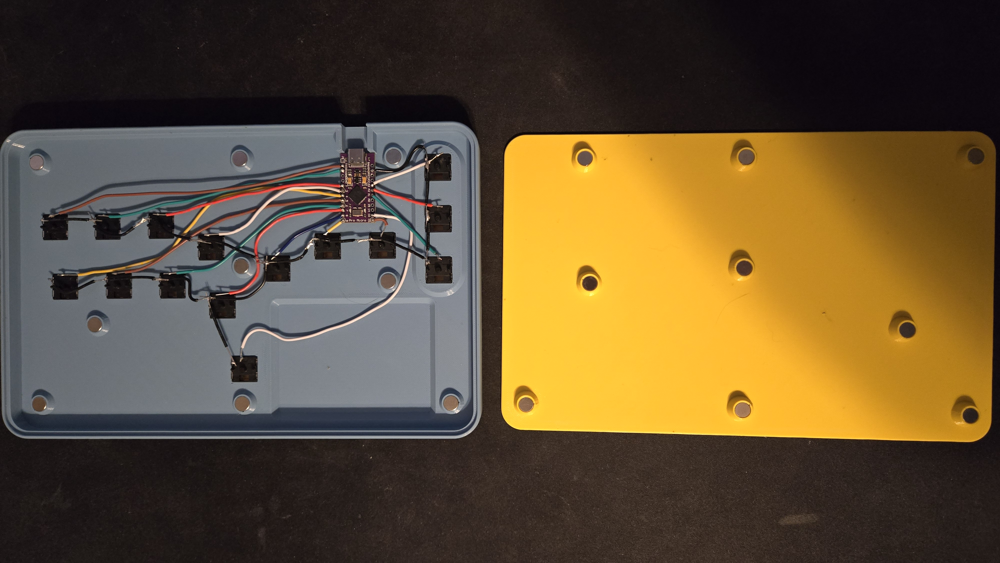
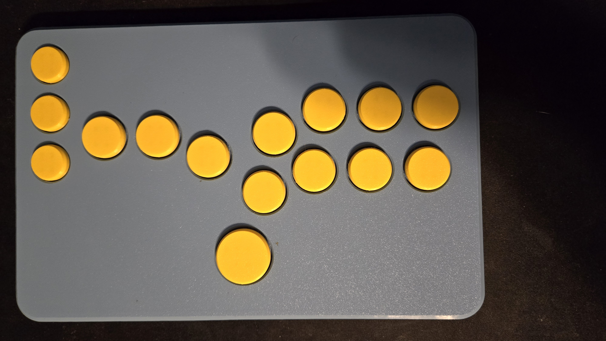
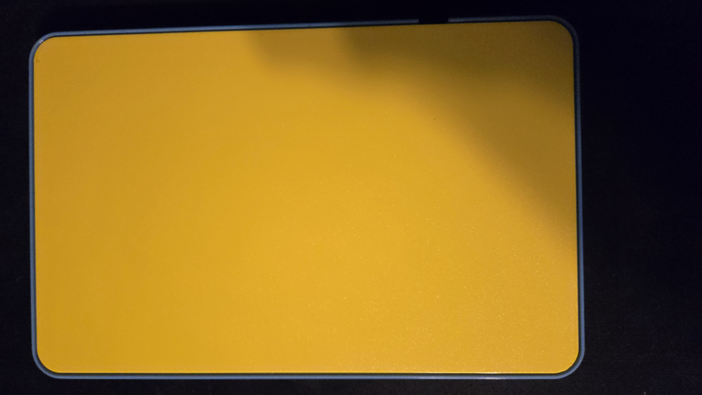

# My Hitbox
&nbsp; | &nbsp; | &nbsp;
--- | --- | ---
 |  | 

## Features
- Simultaneous Opposing Cardinal Directions (SOCD) filtering that prioritizes up over down on the vertical axis and is neutral when both left and right are being pressed.

## Hardware Used
- [1x] Arduino Pro Micro
    - Secured to the back of the 3D print using double-sided tape.
- [18x] 3 x 8 mm round magnets
- [15x] Kailh Choc Low Profile Switches (v1)

## 3D Prints
Printed on a Prusa MK4 which has a print volume of 250 x 210 x 220 mm. Total print time for all pieces was about 12 hours.

- [Stickless Slimbox 2040m](https://www.printables.com/model/449392-slimbox-2040-stickless-all-button-low-profile-figh)
    - Modified in [Blender](https://www.blender.org/) to shrink the round magnet housings from 3x10mm to be 3x8mm. Also removed text to reduce the print time.
- [Kailh Choc Arcade Buttons](https://www.printables.com/model/148297-better-printed-arcade-button-kailh-choc-v1-low-pro)

## Flashing Firmware
The steps below are for flashing firmware to an Arduino Pro Micro (Arduino Micro).

1. Download latest [QMK Toolbox](https://github.com/qmk/qmk_toolbox/releases).
1. Open **QMK Toolbox**.
1. Ensure that the correct **MCU (AVR only)** is selected. **Example:** ATmega32U4
1. Click on the **Open** button and select the `MyHitbox.v1.hex` file.
1. Check the **Auto-Flash** checkbox.
1. Reset the board twice in rapid succession to enter the bootloader.
    - I found it may take a few tries to successfully flash the firmware due to the Caterina bootloader.

## Development
- Firmware was developed and built using [Arduino IDE](https://www.arduino.cc/en/software).
- Build HEX file in **Arduino IDE** by navigating to **Sketch** > **Export Compiled Binary**.
    - Alt + Ctrl + S
    - HEX file needed is located at `build/arduino.avr.micro/MyHitbox.ino.hex`.

## Side Quests
### Flashing Corrupted Bootloader
While I was learning about the Arduino Pro Micro's firmware upload process I mistakenly corrupted the Caterina bootloader, bricking the controller. This led me to learn about [Arduino as In-circuit Serial Programmers (ISP)](https://docs.arduino.cc/built-in-examples/arduino-isp/ArduinoISP) which allows for programming of the whole flash memory of the microcontroller, bootloader included, through a specific set of pins connected to a separate programmer board. I had an [ESPWROOM32](https://www.espressif.com/sites/default/files/documentation/esp32-wroom-32_datasheet_en.pdf) laying around to use as a programmer board.

#### Steps Taken
1. In the **Arduino IDE** load the **ArduinoISP** example. It can be found under **File** > **Examples** > **11. Arduino ISP** > **ArduinoISP**.
1. Update the **RESET**, **LED_HB**, **LED_ERR** and **LED_PMODE** pins to be 22, 32, 33 and 25 respectively.
    - **RESET** is originally set to GPIO8 but on the ESP32 pin 8 is for internal SDI. When this pin is used the board enters a bootloop with a TG1WDT_SYS_RESET error.
    - **LED_HB**, **LED_ERR** and **LED_PMODE** are also set to internal pins and need to be reassigned to available output pins to avoid the bootloop.
1. Upload the modified **ArduinoISP** sketch to the ESP32.
1. Hook up the ISP wires between the programmer and target board according to the [Pin Map](#pin-map).
1. Update the target board to be **Arduino Micro**. It can be set under **Tools** > **Board** > **Arduino AVR Boards** > **Arduino Micro**.
1. Set the programmer to be **Arduino as ISP**. It can be found under **Tools** > **Programmer** > **Arduino as ISP**.
1. Burn the bootloader to the target board using the programmer. It can be done from **Tools** > **Burn Bootloader**.

#### Pin Map
Description | ESP32 Pin | Arduino Micro Pin
--- | --- | ---
VCC | VIN | VCC
GND | GND | GND
MISO | 19 | 14
MOSI | 23 | 16
SCK | 18 | 15
RESET | 22 | RST
